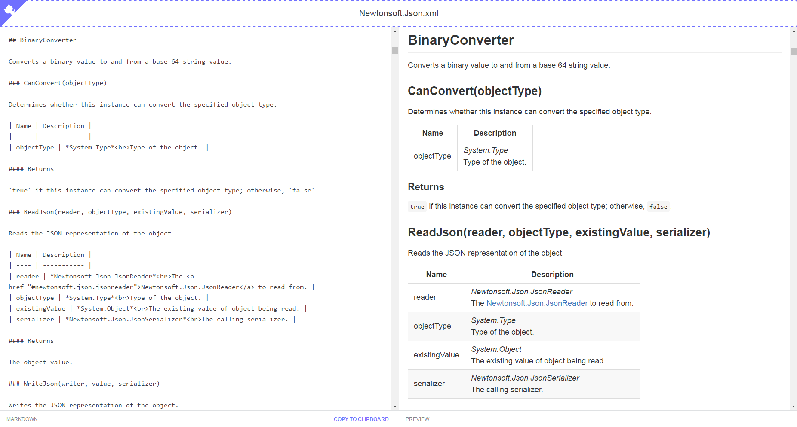

## What is this sorcery?

vsdoc-2-md is an online Visual Studio XML documentation to Markdown converter. Its aim is to enable to quickly scaffold API documentation for sites such as GitHub.

This fork aims at splitting code and converting it to TypeScript.

Included is a basic Markdown editor as well as an HTML preview.

> It can be used to generate Markdown for large projects but the editor is mainly to be used for smaller projects. No optimizations have been put in to accommodate for the editor and preview needs for large amount of Markdown.

